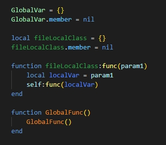
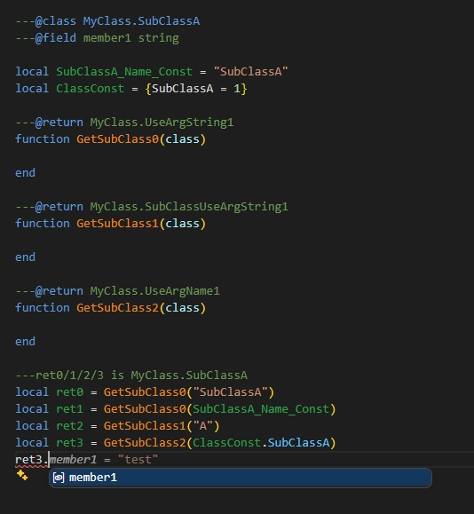

[原始 README / Original README](./README_original.md)

---

# LuaHelper 更新说明

在原版 LuaHelper 基础上进行了以下扩展和增强：

## 1. 支持更多的语义着色类型


|  类型 | 说明 |
|------|------|
| Global Variable | 全局变量 |
| Global Function | 全局函数 |
| Annotate Type | 注解类型 |
| **Local Variable** | 局部变量 *(新增)* |
| **Parameter** | 函数参数 *(新增)* |
| **Member Field** | 成员变量/字段访问 *(新增)* |
| **File Local Var** | 文件顶层local变量（通常代表class/module） *(新增)* |
| **Member Function** | 成员函数（调用/定义的函数） *(新增)* |

所有颜色均可在 VS Code 设置中通过 `luahelper.colors.*` 自定义配置。



## 2. 更广泛的注解类型收集

原版中，`---@class` 定义的类型只能关联同文件内的变量成员。现在支持**跨文件关联**：

- 当文件 A 定义了 `---@class MyClass`，文件 B 中使用 `---@type MyClass` 修饰变量并在其上定义子成员（方法、字段）时，这些子成员也会被收集到 `MyClass` 的定义中
- 查找子成员时（如代码补全、跳转定义），会同时搜索本文件关联变量和跨文件关联变量

```lua
-- fileA.lua
---@class ClassName
---@field name string

-- fileB.lua
---@type ClassName
local inst = {}
function inst.doSomething()  -- 此方法也会被收集为 ClassName 的成员
end
```

## 3. 新增注解类型：`UseArgNameX` 和 `UseArgStringX`

新增两种特殊的注解占位符类型，用于在函数返回类型中**动态引用调用参数**来构造类型名：

### 3.1 `UseArgNameX`（X = 1~4）

取函数调用第 X 个参数的**最后一部分名称**作为类型名的一部分。

适用于参数是变量引用（非字符串字面量）的场景：

### 3.2 `UseArgStringX`（X = 1~4）

取函数调用第 X 个参数的**字符串字面量值**作为类型名的一部分。

支持直接字符串和变量追踪：

如果参数不是直接字符串，会尝试追踪变量值：


### 3.3 组合使用

占位符可以嵌入在更长的类型名中：



---
